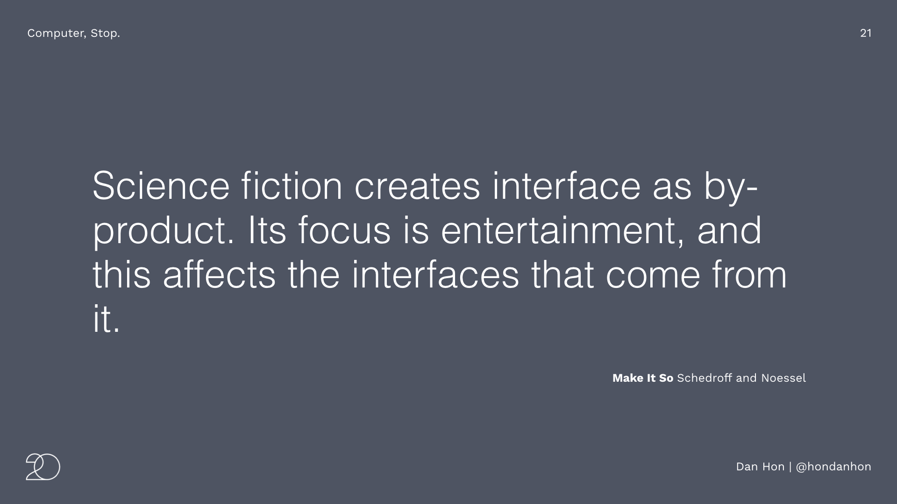
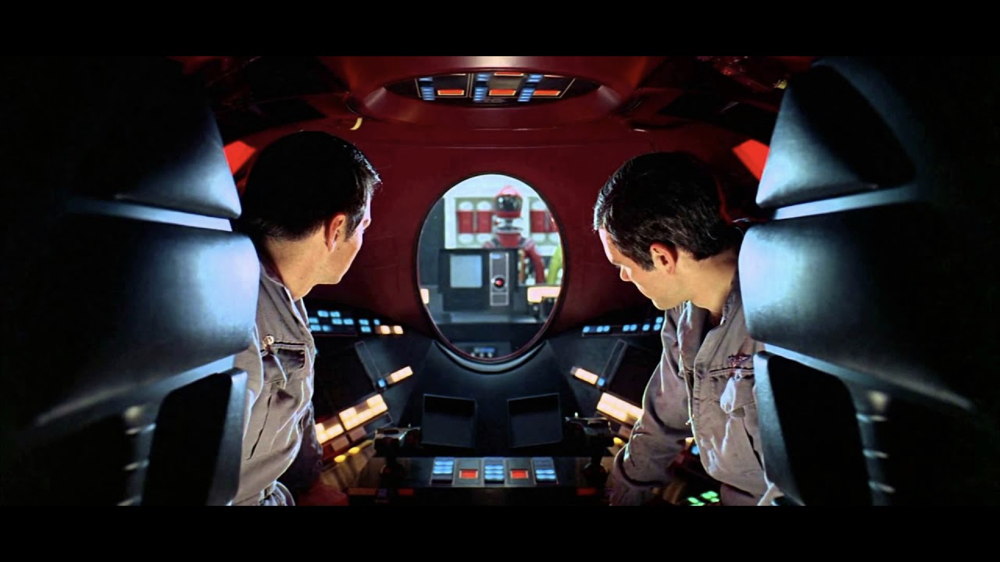
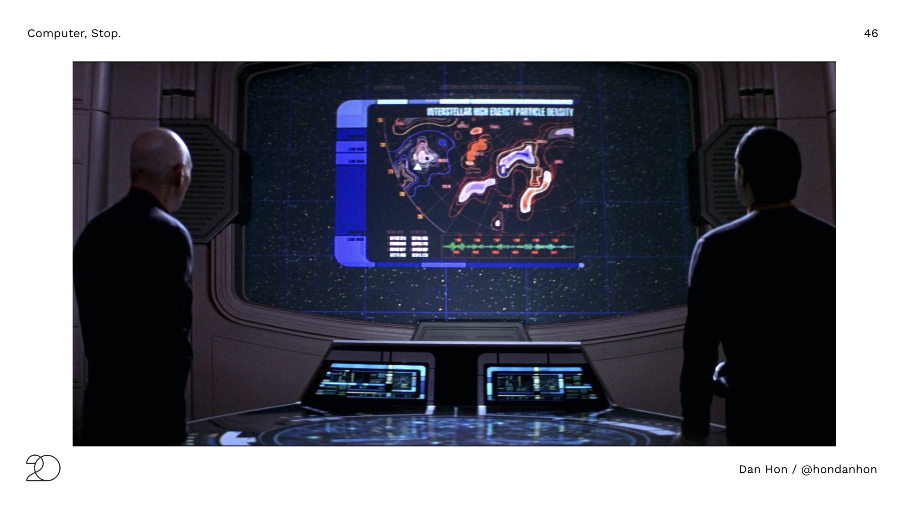

# Computer, Stop: Why Star Trek only goes so far and we need to try harder than science fiction

This talk was first presented at [Interaction 20](https://interaction20.ixda.org/program/computer-stop-why-star-trek-only-goes-so-far-and-we-need-to-try-harder-than-science-fiction). 

Good morning, I’m Dan Hon. 
I’m going to start off gently this morning, because this talk is mainly a joke about star trek and tea so don’t worry, you don’t have to think too hard yet.

1 First, I will do the star trek interaction design joke
2 I’ll share some ideas about why it’s easy for design to borrow from science fiction
3, I’ll talk about the land of missed expectations and unforeseen consequences
4, some ideas about how we can responsibly borrow from science fiction
5 a couple of examples that I find interesting
Then we’ll be ready to wrap up and we can listen to Simone

## First, the Star Trek interaction design joke

So this is mainly a joke about tea.

This is Captain Jean-Luc Picard. He’s the captain of a starship in the 24th century. It has a very sophisticated computer that you can talk to. From what we can tell, he mainly uses his ship computer to do this:

<video width="640" height="480" controls>
  <source src="mp4/tea_earl_grey_picard.mp4" type="video/mp4">
Your browser does not support the video tag.
</video>

Thank you, Captain Picard.

Star Trek’s vision of a voice interface to computing was - and remains - really compelling, to the extent that  Just over three years ago, Amazon added a wake word to the Echo  so we can pretend to talk to the first mass market voice assistant as if we’re on a space ship on the 24th century.

Now, the thing is that you can’t think too hard about this. Because if you start thinking too hard about how Captain Picard orders his tea, then you start realizing that maybe it doesn’t work the way you think it works: “Tea, earl grey, hot” is a three-word command phrase. 

“Tea”, makes sense. “Earl grey” makes sense too, you’re specifying the kind of tea. You might want, I don’t know. Chamomile. Green tea. Actually don’t think too hard about green tea, right? (I mean, what kind?!)

It’s with the last word that you start losing me, I’m afraid. “Hot?” Hot… makes… some sense? I mean, I guess you might want cold tea. Or tepid tea. Or if you’re American, you might like iced tea. But this is so exciting! Talking to computers to get tea! Let’s get right on it and start developing skills for Alex and Siri and… wait.

me, also an alexa owner: COMPUTER, TELL skill REPLICATOR to "PREPARE recipe Dan’s Favorite Drink from Dan’s Recipe Collection" 

Computer: OK, I added Dan’s Favorite Drink to your shopping list. *Note: doesn’t actually do this. 

That was back in the 90s though. Things have changed! We have iPhones now and CBS has brought Captain Picard back.

He’s much older now, so all we need to do is see if he orders tea and if it’s changed…

Yes!
He’s at his winery in France and he’s ordering a drink! What did he ask for?

Great.

Super good.

Wait, what?

This doesn’t make any sense! 

I mean, the decaf part makes sense. He’s 90 years old now. He probably wants to slow down a bit now that he’s not a captain.

Shouldn’t he be saying Tea, Earl Grey, Hot, Decaf? Or some other combination? Tea, Decaf Earl Grey, Hot? 

It should. But he doesn’t say that because those four words don’t scan. Because the point is to tell us something about Picard. He’s older now. Star Trek is a story, not an interaction design manual.

Apart from when it is an interaction design manual. 

## Why do we keep borrowing from science fiction?

So why do we keep borrowing from Science Fiction? 

I’m indebted to the book Make It So, by Nathan Shedroff and Christopher Noessel. Make it So is what I’d consider a textbook on critiquing science fiction as a source of interaction design. I’m fairly sure it has far fewer jokes than this presentation, but it is also much longer and more vigorously researched than this talk. I highly recommend it. 

This is what Shedroff and Noessel have to say: 

> Science fiction creates interface as by-product. Its focus is entertainment, and this affects the interfaces that come from it.

In fiction, when we see interfaces and interaction, they exist for the purpose of telling a story and, broadly, to entertain. 

What does that mean? It means everything that’s shown or described to us exists in a very narrow context and domain. Some of these domains align with the needs we intend to address, which is why science fiction serves as a useful provocation. I’m going to talk about three reasons why I think science fiction is so compelling for us to keep coming back to it, and how it connects to us as human beings on an emotional level. 

### 1. We love stories set in believable worlds

The first is that we love stories set in believable worlds that we can lose ourselves in. This doesn’t mean the world has to be realistic, just that it’s consistent. 

These might be the post-apocalyptic, post-brexit world of 2006’s Children of Men:

... or the harrowing chernobyl-style documentry about a failed genetic engineering theme park, in 1993’s Jurassic Park:

or the surveillance state of 2016’s Jason Bourne: 

These science fictional worlds immerse us and create suspension of disbelief.

In other words, they work to persuade us.

### 2. We love stories about capability, mastery and agency.

I think stories about people succeeding resonate with us. If I were to handwave an unsubstantiated cognitive psychology explanation, it would involve something like our mirror neurons firing when we see competent people achieving their goals. 

In other words, we like to cosplay competency.

Here's two examples.

In 2020, any talk about science fiction is contractually required to include one Marvel universe reference:

Here, Tony Stark, a billionaire playboy genius philanthropist solves time travel, which I suppose is quite masterful.  (the clue is in “model successful” up there).

I’m not saying “this interface looks cool”, and more “this interface is tied up with telling the story about Tony Stark solving time travel.” Part of its job is to show how capable Tony is. 

That’s Tony. 

I have another example:

<video width="640" height="480" controls>
  <source src="mp4/lexi_unix_system.mp4" type="video/mp4">
Your browser does not support the video tag.
</video>

That was Lexi, one of my favorite fictional computer science heroes. 

What Lexi is using is FSN, the filesystem navigator for SGI’s Irix OS. FSN was a real thing, intended to show off the 3D rendering capabilities of SGI’s workstation.

I mean, cloning dinosaurs and bringing them to life and housing them in a theme park full of health and safety violations is science fiction. But the filesystem navigator is not. Again, the point here is: Lexi’s an amazing smart girl who is a role model, and also you should buy SGI workstations. 

OK, last part coming up:

### 3. They help us understand people

This is about how interfaces and interaction in science fiction is used to create understanding with another person, separate from what those people do. It’s science fiction that shows a little of _what it is like to be another person_. 

<video width="640" height="290" controls>
  <source src="mp4/terminator_experience.mp4" type="video/mp4">
Your browser does not support the video tag.
</video>

What we’re looking at here is a representation of the internal state of the Terminator, an artificially intelligent killing machine from the 1984 movie. This obviously isn’t what the Terminator experiences. At best, it’s a debug mode. What we’re seeing is an interface for humans, that helps us understand the Terminator’s internal state, but we never see _how_ we might access it. 

And to play it straight, this is from 1998’s You’ve Got Mail, where we’ve got the equivalent of seeing a character’s diary or correspondence, but on a screen:

Oh, right. I have one more reason why we borrow from science fiction.

I was going to try not including Minority Report in a talk about science fiction but apparently it was unavoidable.

Part of the reason why we keep going back to the well of science fiction is because your client or boss has been busy watching a $102 million pitch video that someone else paid for, and now they want to buy it, even if it makes no sense, but because it makes sense in the movie.

In an exercise of extreme restraint, this will be the ONLY REFERENCE to Minority Report. My point here is that Science fiction is popular culture, which means it’s a common point of reference, which makes it something customers and clients want, and easy to sell. 

Also, people think it looks cool. 

## What could go wrong?

OK, so now we know a little bit about why inspiration from science fiction might be so compelling. But as I’d like to put it another way, what could possibly go wrong?

The first is that we could lose trust.

### 1. We lose trust

This is Gartner's hype cycle:

There is very exciting part of the hype cycle for me, which is not the peak of inflated expectations. No, it's the...

... trough of disillusionment.

Because science fiction is part of pop culture, when it collides with reality, the results can be incredibly disappointing. Customers and users have seen the pitch video. They’ve paid attention to it. Indeed, they’ve even paid to see it. Science fiction has made promises to people that our products frequently aren’t able to keep. Promises from pop culture are as relevant as promises from marketing.

Remember this wonderful kitchen interactoin?

> COMPUTER, TELL skill REPLICATOR to "PREPARE recipe Picard Hot Drink number one from My Recipe Collection" 

> Computer: OK, I added Hot Drink to number one's shopping list

Or this famous scene from 2001:

> Bowman: HAL, send a message to the Odyssey 

> HAL: I couldn’t find The Odyssey in your address book. Did you mean Martin Odessa?

Sometimes, the easy flow is subverted in pop culture, but not often:

<video width="600" height="480" controls>
  <source src="mp4/tomato_soup.mp4" type="video/mp4">
Your browser does not support the video tag.
</video>

This guy is just a junior lieutenant. Nowhere near a captain. Look how difficult his experience is. Which leads me on to…

### 2. We don't need another hero

In Minority Report, we only start to see undesirable states when Tom Cruise’s character, an otherwise competent, white, middle class everyman, gets stuck in the system and then we see what it might be like for anyone who’s not like him. 

Star Trek’s model for voice computer interaction portrays a world of ubiquitous computing that is seductive, but its fiction provides practically no framework to address issues of persistent total surveillance. 

I’d argue that uncritically being inspired by visions like this leads to products like Ring being used in problematic ways without enough examination. 

### 3. And only some people get to be heroes

Like most media, SF is overwhelmingly white and male. Progress has been made in the last few years. But some of the most influential science fiction remains rooted in a very particular social and racial and economic context. In other words: a happy path only exists for certain people. 

## How can we stop and check whether we should?

So, can we be responsibly inspired? How can we interrogate science fiction? In the words of Dr. Ian Malcolm, how can we stop and check whether we should?

### 1. Science fiction isn't design fiction

This first of which is wonderfully expressed by the team at the Near Future Laboratory in a newsletter from them last October:

This is what the Near Future Laboratory have to say:

> Creating an artifact forces you to get into the details of your future world in a way that writing a story does not.

> When writing, it is easy to skip over uncomfortable details in favor of the “big picture”. Design Fiction makes you sweat the details. Good design sweats the details through-and-through.

The point here is that creating real, usable artifacts not stories or films makes it easier to interrogate designs and fictions. How does this work? How does it break? 

### 2. Where I start being obtusely dumb 

The second point is mainly a dumb joke that I hope is somewhat useful. 

When we look at science fiction, can we imagine what the mundane uses might be like? When Neal Stephenson says how the street finds its own uses for things, what would it be like if the characters from The Office used it?

You might not be the hero. You might be Karen in procurement. 

E.g. What if we never get better at PowerPoint?

Here: Look at all that interesting data. Charts and graphs and things. 

This is practically an information knowledge worker vision video for the 24th century.

But wait! What happens if I put some realistic PowerPoint in? 

Exactly. Here's another one. Look at all of this scientific data:

And now I'll put in some PowerPoint...

Oops!

You don’t have to do this with Star Trek. You can use the other one, too.

Here's Darth Vader checking out the view: 

But look, one bad PhotoShop edit later and:

Yep, Darth Vader reviewing the Empire's environmental impact assessment process. 

Here's the famous scene where the rebels get briefed on their Death Star bombing run: 

But everyone knows that the real mundanity of war includes detailed knowledge of logistics planning:

(I have the wonderful Dave Rutledge to thank for that wonderful edit, who was inspired after seeing my Star Trek attempts).

One last example:

### 3. The unbearable mundanity of sharing screens

In this last example, I will be absolutely bloody-mindedly stupid to try to prove a point.

Here's a Microsoft future vision video about productivity and collaboration. Look out for the part where the teacher shares something on their screen with a student:

<video width="1920" height="750" controls>
  <source src="mp4/microsoft_vision.mp4" type="video/mp4">
Your browser does not support the video tag.
</video>

See it? Now, fair warning. I am going to be very dumb now, on purpose.

Let's go back to the Enterprise again:

There we are on the bridge with the big screen. Now, imagine you’ve got a team going away doing a bunch of user research or something. 

OK, but probably not with phasers. 

Anyway, your probably discovers a bunch of stuff guarded by people in white jumpsuits: 

... And everyone back on your Enterprise-grade space ship is super interested in what's going on:

So this is what happens:

What happens is that your team member takes a screenshot by hitting Command-Shift-4 and hitting spacebar and DMs it to the @bridgemainscreen bot. 

That was a mundane, stupid example, because this is what humans are like. 

## Two short examples

We're in the last part now. I promised two examples of interaction design inspired by science fiction that I think are interesting:

### GERTY

The first one is GERTY, a robot from the 2009 film Moon:

GERTY is a fantastic robot that communicates not only by voice, but also by emoji that help add emotional context for its human.

You can think of GERTY's emoji as also disclosing GERTY's internal state. There's two other robots that do this, too: TARS and CASE from 2014's Interstellar:

The screens on the front of TARS and CASE show diagnostic internal state, making them easier to interrogate for their human handlers.

I loved seeing this in the robot Baxter, from 2011. 

### Picard to Enterprise

My last example is the communicator badge that Captain Picard is wearing.

Mainly because it's an example of a smart, connected object that doesn't have a screen. A bit like this:

This is the Withings Activité, a smart watch from 2014. It doesn't have a screen but has all the standard MEMS accelerometers and heart rate monitors to track your daily activity. 

Okay, time to sum up.

## Wrapping up

Three points here:

It's easy to get seduced by interaction design concepts from science fiction, and one of the main reasons it's because they work so well in the domain of storytelling. 

These concepts and interfaces are compelling because they align with the goals of compelling storytelling. They're memorable because they attach to the emotional significance of a story. 

One way we can work against the lure of borrowing without interrogation from science fiction is to create actual objects. How would the voice interface work? Don't tell a story about it, make the actual thing and see how it would fall apart.

And for the times when creating artifacts might be too difficult, you can always try being bloody-mindedly stupid about it. 

That's all! 

I write about this and more at my newsletter, [danhon.substack.com](https://danhon.substack.com/) and on Twitter at [@hondanhon](https://twitter.com/@hondanhon). 
